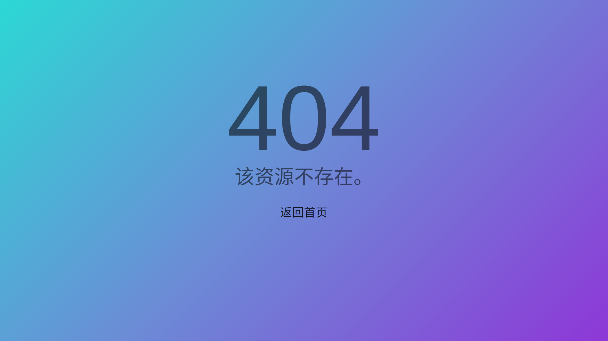

- 体积小巧，完整版需要 75.3KB，轻量压缩版仅需 1.5KB。
- tiny size, The maximum is only 75.3KB, and the minimum is 1.5KB.
- 开箱即用，无需多余配置。
- Download and use, no extra options required.

# 使用资源 / Use-resource
[muicss](https://www.muicss.com)  
[normalize](http://necolas.github.io/normalize.css)  
[iType](https://ityped.surge.sh)  
[webgradients](https://webgradients.com)

# 使用协议 / User-license
  
本作品采用[知识共享署名 4.0 国际许可协议](https://creativecommons.org/licenses/by/4.0/deed.zh)进行许可。

  
This work is licensed under a [Creative Commons Attribution 4.0 International License](http://creativecommons.org/licenses/by/4.0/).
